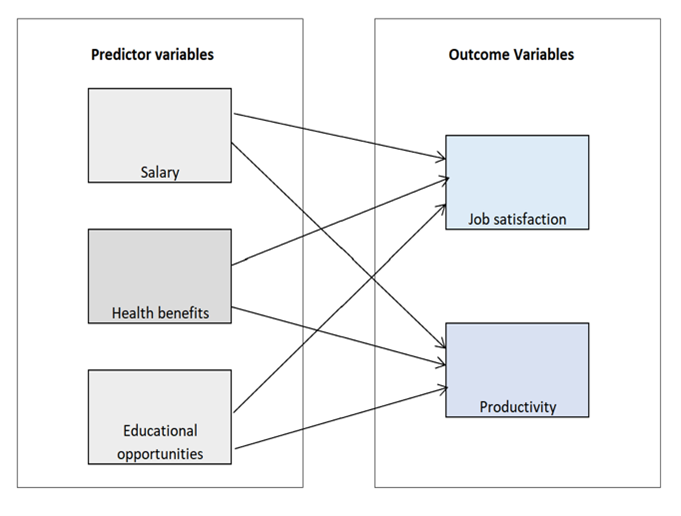
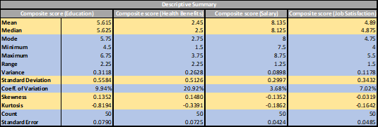
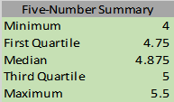
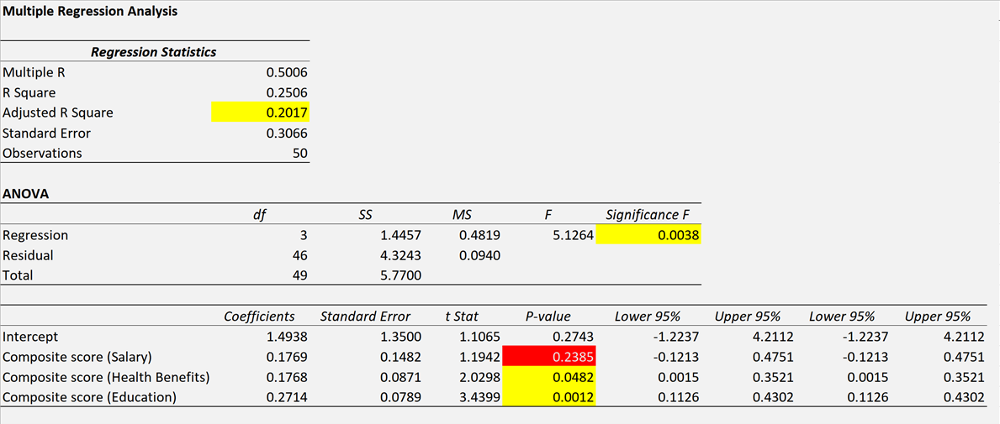
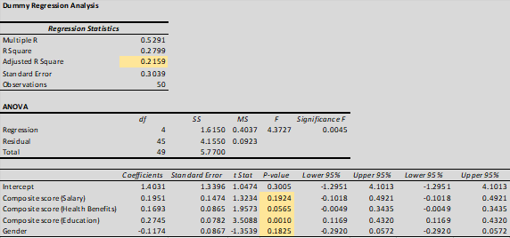
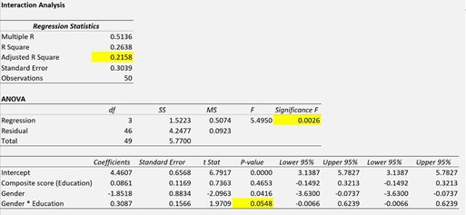

# Analysis of Employee Job Satisfaction Survey

*15th March, 2020*

### **Team 10**

- **Aakash Sirohi**
- **Ana Lucía Vicuña Iriarte**
- **Ji Sung Jung**
- **Jonathan Hur**
- **Mykyta Ahieiev**
- **Yan Yuan**

## **Abstract**

- **Purpose** –  To measure the relationship between employees’ perceptions of organization and job satisfaction.
- **Design/Methodology/Approach** – From the given dataset, we built a regression model which correlated job satisfaction based on predictor variables (e.g., salary, health benefits, etc.) and evaluated the strength of our hypotheses. The sample size of the survey was 50 participants which is sufficiently large so that distribution of sample means is approximately normally distributed. The survey included data from participants on demographics, salary, health benefits, education opportunities, productivity and job satisfaction.
- **Findings** – The measurement methodology had acceptable reliabilities, and observed correlations are consistent with our expectations. The results illustrate that salary, health benefits and gender have no significant effect on job satisfaction. However, we observed that the predictor education has a significant effect on job satisfaction.
- **Limitations**– The dataset considers a sample size of 50 participants, but it is unclear whether the current findings apply to other populations in different organizational settings or cultures. So, the observations maybe industry specific, and/or limited only to the organization from where the data was collected.
- ***Implications*** – After analyzing the dataset, provide recommendations to the organization, that will help drive job satisfaction by concentrating on the selected predictor.

## **Introduction**

The employee’s attitude and behavior are influenced by the relationship between employees and organizations. Understanding the perceptions of employees about their organization is important to figure out the logic behind employees’ attitudes and behaviors toward their job.

Job satisfaction is defined as the extent to which employee overall happiness and approval of the job. It is also associated to an employee’s expectations from the jobs. In our dataset, the researcher selected sample size as 50 participants which used the salary, education and health benefits as predictors, and productivities and job satisfaction as outcomes.

## **Methodology**

**Sampling method.** Dataset is based on a survey of 50 participants, and designed such that the response of the employee to the questions is coded on a scale from 1-9 which indicates the different level of satisfaction under each question.

## **Analysis and Observations**

For the purpose of our analysis, PHStat was used and exploratory variables analysis, distribution tendency and correlation analysis were run for the data. In our dataset, we considered three major predictors (*health benefits, education and salary*) and two outcomes (*Job satisfaction and productivity*). Based on the initial reading of the dataset and the values of the response, we favored considering job satisfaction instead of productivity due to the vastly different ranges among the observations and initial evaluations.  We executed the following three steps analysis to find out the relationship between the three predictors and job satisfaction:

- Step 1 - Descriptive Summary of variables
- Step 2 - Multiple regression test.
- Step 3 - Dummy variable regression test

***Step 1 - Descriptive Summary of Variables***

By using descriptive statistics, we measured mean, median, standard deviation, skewness and kurtosis of the three predictors and one outcome to evaluate normality: 

- **Mean and Median:** We can see the mean and median of three predictors and outcome are approximately very close (e.g. Job Satisfaction mean (4.89) and median (4.875) approximated figures). We can consider it as an approximated normal distribution. Same for health benefits, education and salary.
- **Skewness:** Job satisfaction skewness is -0.0319 almost close to 0, we can consider it as an approximated normal distribution. Same for health benefits, education and salary.
- **Kurtosis:** Job satisfaction kurtosis is - 0.1642 almost close to 0, we can consider it as an approximated normal distribution. Same for health benefits, education and salary.
  
    
    
- Meanwhile, we used the boxplot to visualize the five-number summary as the shape of the distribution for a variable. From the following Boxplot graph, we can also consider that job satisfaction is normal shape.
  
    
    
    
    

***Step 2 - Multiple Regression Test***

The Multiple Regression Test can help us understand the relationship between the dependent variable (job satisfaction) and independent variables (salary, health benefits and education). Before we run the multiple regression, we consider the predictor of salary as having a highly significant effect on job satisfaction compared to health benefits and education, according to our work experience and expectation. So, we propose the following hypotheses:

**Salary**

- H0  =  As salary increases, job satisfaction will not likewise increase.

- H1  =  As salary increases, job satisfaction will likewise increase.

**Health Benefits**

- H0  =  As Health benefits increase, job satisfaction will not likewise increase

- H1  =  As Health benefits increase, job satisfaction will likewise increase

**Educational Opportunities**

- H0  =  As educational opportunities increase, job satisfaction will not likewise increase

- H1  =  As educational opportunities increase, job satisfaction will likewise increase

Under this case we assume that our level of significance is 0.05.

Computed values of the coefficients are: 

$b_0=1.4938$   $b_1=0.1769$    $b_2=0.1768$   $b_3=0.2714$

Thus, the multiple regression equation is: 

$$\hat Y_i=1.4938+0.1769X_{1i}+0.1768X_{2i}+0.2714X_{3i}$$

Where:  $\hat Y_i$ = predicted job satisfaction/ $X_{1i}$ = Salary / $X_{2i}$ = Health Benefits / $X_{3i}$ = Education Opportunities

***Observation 1:** From the coefficients, we can see all the three predictors have positive effect on job satisfaction*

***Observation 2:**The adjusted R-square is around 20.17% meaning the variation in job satisfaction is only 20.17 % due to variation in the salary, in the health benefits, and in the educational opportunities.*

***Observation 3:** Significant F (0.0038) is smaller than α = 0.05, we can conclude that at least one of the independent variables (salary, health benefit, education opportunities) affect job satisfaction.*

***Observation 4:** We analyzed individual independent variables significance.*

1. Salary P-Value is 0.2385 > 0.05, indicates no linear relationship between Salary and Job Satisfaction, so we do not reject null hypothesis.
2. Health Benefits P-Value is 0.0482 < 0.05, indicates a significant linear relationship between Health Benefits and Job Satisfaction, so we reject null hypothesis.
3. Education P-Value is 0.0012 < 0.05, indicates a significant linear relationship between Education and Job Satisfaction, so we reject null hypothesis.

***Observation 5:** The residual plot does not contain any apparent patterns, also looks like a random scattering of points.*

***Observation 6:** From the coefficients of partial determination, we found out 20.46% of the variation in job satisfaction is explained by variation in the education. Much higher than 3.01% of salary and 8.22% of health benefits*

| Coefficients |  |
| --- | --- |
| r2 Y1.23 | 0.030070396  |
| r2 Y2.13 | 0.082204627  |
| r2 Y3.12 | 0.204605129  |

***Step 3 - Dummy Variable Regression Test***

To carry out an in-depth analysis our findings, we think the females are more concerned about job satisfaction than males, so we selected gender as the predictor for Dummy variable regression.

To include the categorical variable Gender, the dummy variable $X_{Gender}$ is defined as:-

1. $*X_{Gender}*$ = 0 if the Gender is male
2. $*X_{Gender}*$ = 1 if the Gender is female

Assuming that the slope of assessed value with the job satisfaction is the same for male and female, the multiple regression model is

$$Y_i=1.4031+0.1951X_{Salary}+0.1693X_{Health}+0.2745X_{Education}-0.1174X_{Gender}$$

***Observation 1:** From the coefficients, we can see the three predictors have positive effect on job satisfaction and gender has inverse effect on job satisfaction*

***Observation 2**:The adjusted R-square is around 21.59% is meaning the variation in job satisfaction is 21.59 % due to the variation in the salary, in the health benefits, in the gender and in the educational opportunities.*

***Observation 3:** Significant F is 0.0045 smaller than level of significance α = 0.05. so we conclude that at least one of the independent variables (salary, health benefit, education opportunities, gender) affect job satisfaction.*

***Observation 4:** We analyzed individual independent variables significance from P-Value, only education has significant effect on job satisfaction. And vice versa (gender, salary and health benefits).*

***Observation 5:** The residual plot does not contain any apparent patterns, also looks like a random scattering of points.*

***Interaction Regression Analysis:***

***Observation 1:** The adjusted R-square is around 21.58% is meaning the variation in job satisfaction is 21.58% due to the variation in the education, in the gender, and in the gender and education interaction.*

***Observation 2:** Significant F is 0.0026 smaller than level of significance a = 0.05. so we conclude that at least one of the independent variables (the gender and education interaction, education opportunities and gender) affect job satisfaction.*

***Observation 3:** We analyzed individual independent variables significance from P-Value, the interaction of gender and education(P-Value is 0.0548) have no significant effect on job satisfaction*

## **Conclusion:**

Regression analysis can help HR managers or related people to get the observation on relationship between two or more variables and allow us to compare the several independent variables, and understand their correlation with dependent variables.

From our findings - Education has significant effect on job satisfaction.  For the best practice in real business context, the HR managers or related people can consider to design the set of actions on employees’ education to enhance the their satisfaction towards their jobs. (e.g. the professional training, company offer specialized course like MBA to employees, certification opportunities, etc.).

Further research is required to assess the applicability of these findings to the general population of employees. Future research should seek to expand the pool of potential explanatory variables as well additional control variables.
